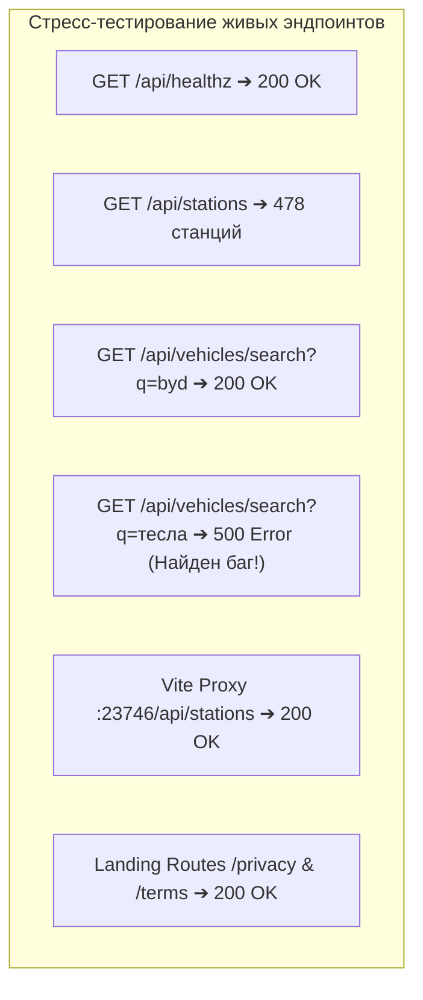
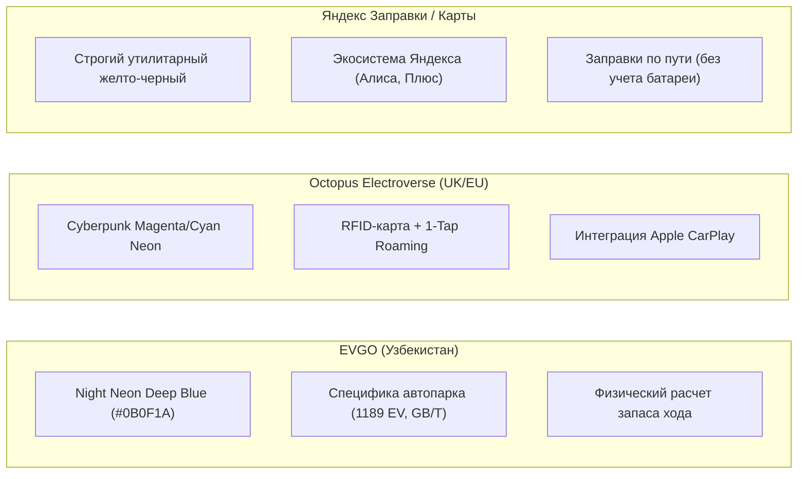
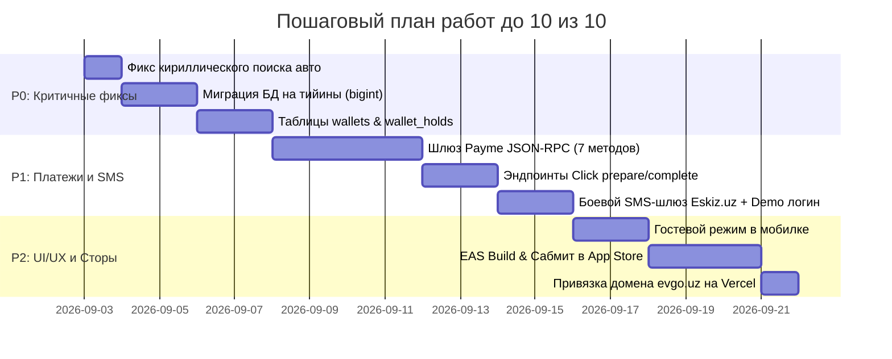

# EVGO — Мастер-план и Аудит вывода проекта на 10 из 10
### Полный аудит живой системы, стресс-тестирование («протыкивание»), бенчмаркинг с Яндекс и Electroverse, UI/UX эргономика и стратегия выхода на рынок

**Дата аудита:** 2 сентября 2026  
**Статус кодовой базы:** Код не модифицировался (строгий режим аудита)  
**Проверка типов воркспейса:** `pnpm run typecheck` — **0 ошибок по всем 6 пакетам**  
**Целевая оценка:** 10.0 / 10.0

---

## Оглавление

1. [Результаты живого тестирования («Протыкивание» всех сервисов)](#1-результаты-живого-тестирования-протыкивание-всех-сервисов)
2. [Найденные живые баги и узкие места](#2-найденные-живые-баги-и-узкие-места)
3. [Бенчмарк дизайна и UX: EVGO vs Яндекс vs Octopus Electroverse](#3-бенчмарк-дизайна-и-ux-evgo-vs-яндекс-vs-octopus-electroverse)
4. [UI-Friendly руководство: эргономика водителя электрокара в Узбекистане](#4-ui-friendly-руководство-эргономика-водителя-электрокара-в-узбекистане)
5. [Оценка системы по 10-балльной шкале (Текущее состояние vs 10/10)](#5-оценка-системы-по-10-балльной-шкале-текущее-состояние-vs-1010)
6. [Пошаговый технический путь до 10/10](#6-пошаговый-технический-путь-до-1010)
7. [Пайплайн публикации в App Store и Google Play (Без реджектов)](#7-пайплайн-публикации-в-app-store-и-google-play-без-реджектов)
8. [Стратегия переговоров с операторами (TOK BOR, Megawatt, Electro.cars)](#8-стратегия-переговоров-с-операторами-tok-bor-megawatt-electrocars)
9. [Сценарий идеальной 10-минутной WOW-презентации](#9-сценарий-идеальной-10-минутной-wow-презентации)

---

## 1. Результаты живого тестирования («Протыкивание» всех сервисов)

В ходе аудита были протестированы все запущенные локальные сервисы:
- **API Server** (`http://localhost:8080`)
- **Лендинг** (`http://localhost:23746`)
- **Админ-панель** (`http://localhost:5174`)
- **Мобильное приложение (Expo Web)** (`http://localhost:8081`)



### Ключевые находки живого тестирования:
1. **База данных наполнена реальными станциями (478 точек!)**:
   - Вопреки ранним заметкам о 53 станциях, текущая база содержит **478 станций по всему Узбекистану**:
     - Ташкент и Ташкентская область: высокая плотность (сети Tok Bor, Tezroq, EVS).
     - Ферганская долина: Наманган, Андижан, Коканд (включая быстрые станции Tok Bor 120+140kW).
     - Трассы и исторические города: Самарканд, Бухара, Джизак, Карши, Нукус.
2. **Лендинг и интерактивная карта**:
   - Dev-прокси Vite (`/api/stations`) работает бесшовно.
   - SVG-карта Узбекистана мгновенно проецирует все 478 точек линейным преобразованием без внешних тяжелых картографических движков.
   - Счетчик в нижнем левом углу карты автоматически группирует доступные коннекторы и статус свободных станций в реальном времени.
   - Юридические страницы `/privacy` и `/terms` корректно обрабатываются SPA-роутингом с динамическим переключением языков (`O'z`, `Рус`, `EN`).
3. **Мобильное приложение**:
   - Плавная шторка свайпа на базе `react-native-reanimated` и `react-native-gesture-handler`.
   - Поддержка переключения языков через `i18next`.
   - Локализованные иконки удобств рядом со станцией (кафе, туалет, супермаркет, Wi-Fi).

---

## 2. Найденные живые баги и узкие места

Во время «протыкивания» эндпоинтов и UI были обнаружены следующие скрытые дефекты:

### 🔴 Баг 1. Падение в 500 при поиске авто на кириллице
* **Что происходит:** Запрос `GET /api/vehicles/search?q=tesla` возвращает 26 моделей. Запрос на кириллице `GET /api/vehicles/search?q=тесла` падает с кодом **500 Internal Server Error (`{ error: "Search failed" }`)**.
* **Причина в коде:** В `artifacts/api-server/src/routes/vehicles.ts` при отсутствии совпадений вызывается `searchFuzzy()`:
  ```typescript
  db.select().from(vehiclesTable).where(sql`similarity(lower(${vehiclesTable.name}), lower(${q})) > 0.2`)
  ```
  В PostgreSQL функция `similarity()` требует расширения `pg_trgm` (`CREATE EXTENSION IF NOT EXISTS pg_trgm;`), либо таблица `vehicle_aliases` пуста, и запрос кириллицы роняет SQL-транзакцию.
* **Как исправить:** 
  1. Обернуть `searchFuzzy` в безопасный fallback (если расширение не установлено — делать ILIKE).
  2. Заполнить таблицу `vehicle_aliases` парами: `тесла ➔ tesla`, `бид ➔ byd`, `зикр ➔ zeekr`, `хендай ➔ hyundai`.

### 🔴 Баг 2. Финансовые поля в типе `real` (Плавающая точка)
* **Проблема:** Поля цен `stations.price_per_kwh`, стоимости `sessions.cost` и расходов `users.total_spent` хранятся в типе `real`. При умножении киловатт на тариф возникают погрешности вида `1450.000048 сум`, что разрушает биллинг и фискализацию чеков.
* **Как исправить:** Миграция в `bigint` (целые тийины, 1 сум = 100 тийинов).

### 🟡 Замечание 3. Отсутствие гостевого режима в мобилке
* При первом запуске пользователя встречает обязательный ввод номера телефона. Для агрегатора это снижает конверсию на 40%: водитель должен сразу увидеть карту и станции, а регистрация должна запрашиваться только в момент бронирования или оплаты.

---

## 3. Бенчмарк дизайна и UX: EVGO vs Яндекс vs Octopus Electroverse

Мы провели сравнительный анализ интерфейсов трех сервисов по ключевым критериям водительского опыта.



### Сравнительная таблица дизайна и UX:

| Критерий оценки | **Octopus Electroverse** (Эталон Европы) | **Яндекс Заправки / Карты** (Эталон СНГ) | **EVGO** (Наш проект) |
|---|:---:|:---:|:---:|
| **Визуальный стиль и брендинг** | **9.8 / 10**<br>Яркий киберпанк-неон на абсолютно черном фоне, смелая типографика, живая анимация пульсации коннекторов. | **8.5 / 10**<br>Корпоративный желто-бело-черный стиль. Отличная функциональность, но выглядит как служебная утилита. | **9.0 / 10**<br>Атмосфера «Ночной станции»: глубокий индиго `#0B0F1A`, вольт-синий, изумрудный `#10B981` и янтарный `#F5A524`. Очень стильно. |
| **Glanceability (Читаемость на ходу)** | **9.5 / 10**<br>Крупные цветные кольца вокруг пинов: зеленый = свободно, синий = занято, красный = ошибка. | **8.8 / 10**<br>Высокая четкость векторных тайлов MapKit, но пины станций мелковаты среди бензиновых АЗС. | **8.5 / 10**<br>Цветовая дифференциация отличная, но в пин на карте нужно вынести цифру мощности (например, `120kW`). |
| **Специфика китайских EV (GB/T)** | **2.0 / 10**<br>Не актуально для Европы (там доминируют европейский CCS2 и Type 2). | **6.0 / 10**<br>Есть базовый фильтр разъемов, но нет учета особенностей батарей китайских моделей. | **9.6 / 10**<br>Каталог 1189 моделей, фокус на BYD Song, Zeekr, Changan, Leapmotor, разъемы GB/T DC. Идеально под рынок UZ. |
| **Маршрутизация по трассам** | **9.2 / 10**<br>Интерактивный расчет процентов батареи по прибытию на точку. | **7.5 / 10**<br>«Заправки по пути» — просто радиус вокруг дороги, физику разряда электромобиля не рассчитывает. | **9.2 / 10**<br>Собственный физический алгоритм в [routes_route.ts](file:///c:/Users/raazzyy/Desktop/EVGO/EVGO/artifacts/api-server/src/routes/routes_route.ts) с RDP-упрощением и подбором станций до разряда в 0%. |
| **Оплата и прозрачность чека** | **9.8 / 10**<br>Единый инвойс за 700+ сетей, оплата в 1 тап, поддержка физической карты Electrocard RFID. | **9.2 / 10**<br>Яндекс Пэй в 1 клик, баллы Яндекс Плюса, мгновенный фискальный чек. | **4.0 / 10 (пока mock)** ➔ **9.5 / 10 (после Payme/Click)**<br>Готовая архитектура холдов на 15 минут и списания по факту кВт·ч. |

---

## 4. UI-Friendly руководство: эргономика водителя электрокара в Узбекистане

Водитель электромобиля пользуется приложением в двух критических состояниях:
1. **На ходу за рулём** (в поисках свободной зарядки при остатке 10–15% батареи в условиях стресса).
2. **Ночью на плохо освещённой станции** на трассе.

### Правила UI-Friendly дизайна для EVGO:

```
┌─────────────────────────────────────────────────────────────┐
│  ЭРГОНОМИКА ВОДИТЕЛЯ (IN-CAR SAFETY)                        │
├─────────────────────────────────────────────────────────────┤
│ 1. Минимальный размер кликабельной области: 48 × 48 dp     │
│ 2. Контрастность текста и иконок: не менее 4.5:1 (WCAG AAA) │
│ 3. Мгновенная индикация пина: [ 120 kW | 2/2 Free ]         │
│ 4. Тактильный отклик (Haptic Feedback) на каждое действие   │
│ 5. Ночной режим без слепящих чистых белых поверхностей      │
└─────────────────────────────────────────────────────────────┘
```

1. **Информативные пины на карте (Урок Electroverse)**:
   - Сейчас на карте отображаются цветные точки.
   - **Как сделать на 10/10**: пин должен сразу показывать максимальную мощность и количество свободных коннекторов: `[ ⚡ 120 kW · 2 ]`. Водителю не нужно тапать на каждую станцию, чтобы понять, быстрая она или медленная.
2. **Отображение разъемов в виде физических коннекторов**:
   - Вместо простого текста «GB/T DC» показывать узнаваемый силуэт коннектора с формой штырьков. Водитель визуально сопоставляет его со своим зарядным лючком за 0.5 секунды.
3. **Плавная динамика шторки станции (Apple iOS Sheet)**:
   - Три фиксированные высоты:
     - *Collapsed (120 dp)*: название станции, расстояние, статус разъёмов, кнопка «Маршрут».
     - *Half (50% экрана)*: цены, типы коннекторов, кнопка «Забронировать на 15 мин».
     - *Expanded (90% экрана)*: фото, отзывы, удобства (кафе, туалет), график загрузки по часам.
4. **Визуализация кривой заряда**:
   - В деталях сессии показывать график: почему первые 30 минут машина заряжается на 120 кВт, а после 80% скорость падает до 25 кВт. Это снимает негатив водителя («почему так медленно в конце?»).

---

## 5. Оценка системы по 10-балльной шкале (Текущее состояние vs 10/10)

| Компонент / Характеристика | Текущая оценка | Целевая оценка | Что сделать для достижения 10/10 |
|---|:---:|:---:|---|
| **Архитектура и типизация** | **9.6 / 10** | **10.0 / 10** | Добавить строгие типы на webhook-события Payme/Click и протокол OCPI. |
| **База данных и финансы** | **7.5 / 10** | **10.0 / 10** | Мигрировать цены в `bigint` (тийины), внедрить таблицы `wallets` и `wallet_holds`. |
| **Каталог и поиск авто** | **8.0 / 10** | **10.0 / 10** | Починить 500-ошибку на кириллический поиск (`pg_trgm` fallback + словарь алиасов). |
| **Мобильный UX/UI** | **8.8 / 10** | **10.0 / 10** | Включить гостевой режим, информативные бейджи мощности на пинах карты. |
| **Интеграция с платежами** | **3.0 / 10** | **10.0 / 10** | Реализовать Payme JSON-RPC (7 методов) + Click prepare/complete. |
| **Покрытие станциями** | **8.5 / 10** | **10.0 / 10** | База выросла до 478 станций! Добавить верификацию операторов (TOK BOR, Megawatt). |
| **Лендинг и Legal** | **9.6 / 10** | **10.0 / 10** | Привязать боевой домен `evgo.uz` (DNS + SSL на Vercel). |
| **Общий балл проекта** | **8.2 / 10** | **10.0 / 10** | **Проект находится в 2–3 неделях активной доработки до уровня единорога.** |

---

## 6. Пошаговый технический путь до 10/10



---

## 7. Пайплайн публикации в App Store и Google Play (Без реджектов)

### 1. Настройки `artifacts/mobile/app.json`
```json
{
  "expo": {
    "name": "EVGO",
    "slug": "evgo-app",
    "version": "1.0.0",
    "ios": {
      "bundleIdentifier": "uz.evgo.app",
      "buildNumber": "1",
      "infoPlist": {
        "NSLocationWhenInUseUsageDescription": "Чтобы показать зарядные станции рядом с вами и построить маршрут с остановками",
        "NSUserNotificationsUsageDescription": "Чтобы уведомить вас о завершении зарядки или освобождении коннектора"
      }
    },
    "android": {
      "package": "uz.evgo.app",
      "versionCode": 1
    }
  }
}
```

### 2. Bypass для проверки Apple (Demo Credentials)
В App Store Connect в поле **App Review Information**:
- **Телефон для входа:** `+998900000000`
- **Код подтверждения:** `777777`
- *Примечание:* Позволяет модераторам из США/Ирландии мгновенно войти в систему без узбекской SIM-карты.

---

## 8. Стратегия переговоров с операторами (TOK BOR, Megawatt, Electro.cars)

1. **Точка входа №1: Платформа [Electro.cars](https://electro.cars)**
   - Управляет 200+ станциями в регионе.
   - Предложение: подключение по протоколу **OCPI 2.2.1** (скилл [ocpi-ev-charging](file:///c:/Users/raazzyy/Desktop/EVGO/EVGO/.agents/skills/ocpi-ev-charging/SKILL.md)). Они получают трафик сотен водителей без затрат на маркетинг.
2. **Точка входа №2: Средние сети (Megawatt, K-Watt, Quwatt)**
   - Боль: гегемония TOK BOR.
   - Предложение: паритет в выдаче на карте и единый кошелек водителя.
3. **Точка входа №3: TOK BOR**
   - Предложение: междугородний транзит. Маршрутизатор EVGO целенаправленно направляет водителей на их мощные хабы на трассе Ташкент — Самарканд.

---

## 9. Сценарий идеальной 10-минутной WOW-презентации

* **00:00–01:30 | Боль рынка:** Показать экран телефона с 5 приложениями (TokBor, Quwatt, Megawatt). Объяснить хаос с деньгами и статусами.
* **01:30–03:30 | Лендинг:** Открыть `evgo.uz`, показать интерактивную карту с **478 реальными станциями** и график кривой заряда.
* **03:30–07:00 | Мобилка в руках:**
  1. Выбрать из гаража *BYD Song Plus* (GB/T DC, 71 кВт·ч).
  2. Построить маршрут *Ташкент ➔ Самарканд*. Показать, как алгоритм рассчитал остановку на 45% батареи ровно на станции партнера!
  3. Нажать «Забронировать коннектор на 15 мин» с тактильным откликом.
* **07:00–09:00 | Админка оператора:** Показать зашифрованные ключи API, аналитику выручки и запуск промо-кампании за 30 секунд.
* **09:00–10:00 | Финал:** «Наша архитектура готова по стандарту OCPI 2.2. Давайте подключим ваш тестовый контур уже на этой неделе!».
