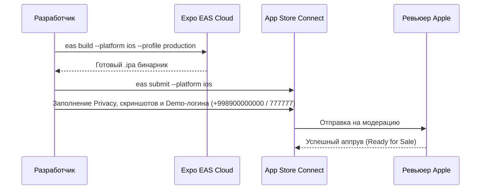
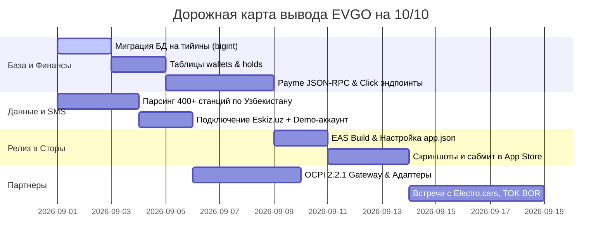

# EVGO — Мастер-план вывода проекта на 10 из 10
### Полное руководство по разработке, монетизации, релизу в App Store / Google Play и переговорам с операторами

**Дата:** 30 августа 2026  
**Проект:** EVGO — Агрегатор зарядных станций для электромобилей (Узбекистан)  
**Репозиторий:** `Raazzyy/EVGO`  
**Целевая оценка:** 10.0 / 10.0

---

## Оглавление

1. [Текущее состояние и матрица доведения до 10/10](#1-текущее-состояние-и-матрица-доведения-до-1010)
2. [Блок 1. Финансовый контур и база данных (Критичный фикс)](#блок-1-финансовый-контур-и-база-данных-критичный-фикс)
3. [Блок 2. Интеграция платежных систем (Payme, Click, Uzum)](#блок-2-интеграция-платежных-систем-payme-click-uzum)
4. [Блок 3. Авторизация, SMS-шлюз и демо-режим для Apple](#блок-3-авторизация-sms-шлюз-и-демо-режим-для-apple)
5. [Блок 4. Наполнение базы: расширение покрытия до 400+ станций](#блок-4-наполнение-базы-расширение-покрытия-до-400-станций)
6. [Блок 5. Полировка мобильного приложения (UX, оффлайн, гостевой режим)](#блок-5-полировка-мобильного-приложения-ux-оффлайн-гостевой-режим)
7. [Блок 6. Полный пайплайн публикации в App Store и Google Play](#блок-6-полный-пайплайн-публикации-в-app-store-и-google-play)
8. [Блок 7. Стратегия переговоров и интеграции с операторами (TOK BOR, Megawatt, Electro.cars)](#блок-7-стратегия-переговоров-и-интеграции-с-операторами-tok-bor-megawatt-electrocars)
9. [Блок 8. Сценарий идеальной WOW-презентации на встрече](#блок-8-сценарий-идеальной-wow-презентации-на-встрече)
10. [Сводная таблица задач и очередность выполнения](#сводная-таблица-задач-и-очередность-выполнения)

---

## 1. Текущее состояние и матрица доведения до 10/10

| Направление | Сейчас | Цель | Что отделяет от 10/10 |
|---|:---:|:---:|---|
| **Архитектура и типы** | **9.5** | **10.0** | Добавить строгие zod-схемы для платежных webhook-запросов и OCPI-событий. |
| **База данных и финансы** | **7.0** | **10.0** | Поля цен в типе `real` теряют тийины. Нужен перевод в `bigint`, внедрение холдов и `SELECT ... FOR UPDATE`. |
| **Платежи и кошелек** | **3.0** | **10.0** | Сейчас платежи — заглушка. Нужна связка Payme JSON-RPC (7 методов) + Click prepare/complete + Uzum. |
| **Мобильное приложение** | **8.5** | **10.0** | Гостевой режим (карта без входа), оффлайн-кэш, адаптация Dynamic Type под любые размеры шрифтов iOS. |
| **Лендинг** | **9.5** | **10.0** | Привязать боевой домен `evgo.uz`, настроить автоматический деплой на Vercel/Cloudflare Pages. |
| **Покрытие станциями** | **5.0** | **10.0** | 53 станции из OpenChargeMap покрывают ~5% рынка. Нужно наполнить базу до 400+ станций по Узбекистану. |
| **Партнёрский контур** | **6.0** | **10.0** | Внедрить поддержку протокола OCPI 2.2.1 и адаптеры для CPO-операторов. |

---

## Блок 1. Финансовый контур и база данных (Критичный фикс)

### Почему это критично
В JavaScript и PostgreSQL тип `real` (32-битное число с плавающей точкой) при расчётах накапливает погрешность: `0.1 + 0.2 !== 0.3`. В финтехе и биллинге электроэнергии (где цена за кВт·ч умножается на доли киловатт) это приводит к расхождению балансов и непрохождению аудита налоговой/Payme.

### План реализации (в `lib/db`):
1. **Миграция полей в тийины (`bigint`)**:
   - `stations.price_per_kwh` ➔ `bigint` (тийины за 1 кВт·ч, например, `220000` = 2 200 сум).
   - `stations.cost_price_per_kwh` ➔ `bigint`.
   - `sessions.cost` ➔ `bigint`.
   - `users.total_spent` ➔ `bigint`.

2. **Создание таблиц кошелька и холдирования**:
   ```typescript
   // lib/db/src/schema/wallets.ts
   export const walletsTable = pgTable("wallets", {
     id: serial("id").primaryKey(),
     user_id: integer("user_id").notNull().unique().references(() => usersTable.id),
     balance_tiyins: bigint("balance_tiyins", { mode: "bigint" }).notNull().default(0n),
     updated_at: timestamp("updated_at", { withTimezone: true }).notNull().defaultNow(),
   });

   // lib/db/src/schema/wallet_holds.ts
   export const walletHoldsTable = pgTable("wallet_holds", {
     id: serial("id").primaryKey(),
     wallet_id: integer("wallet_id").notNull().references(() => walletsTable.id),
     session_id: integer("session_id").references(() => sessionsTable.id),
     amount_tiyins: bigint("amount_tiyins", { mode: "bigint" }).notNull(),
     status: pgEnum("hold_status", ["active", "captured", "released"])("status").notNull().default("active"),
     expires_at: timestamp("expires_at", { withTimezone: true }).notNull(),
     created_at: timestamp("created_at", { withTimezone: true }).notNull().defaultNow(),
   });
   ```

3. **Атомарное списание (Защита от состояния гонки)**:
   - Любое списание или наложение холда выполняется внутри транзакции с блокировкой строки пользователя:
     ```sql
     SELECT * FROM wallets WHERE user_id = $1 FOR UPDATE;
     ```

---

## Блок 2. Интеграция платежных систем (Payme, Click, Uzum)

### 1. Payme JSON-RPC (Протокол взаимодействия)
- Эндпоинт: `POST /api/payments/payme`
- Авторизация: `Authorization: Basic <base64("Paycom:" + PAYME_KEY)>`
- Ограничение по IP: входящие запросы принимаются только из подсети Payme: `185.234.113.1` — `185.234.113.15`.
- **7 обязательных методов**:
  1. `CheckPerformTransaction` — проверка существования кошелька и суммы пополнения.
  2. `CreateTransaction` — фиксация транзакции в статусе `STATE_CREATED` (1).
  3. `PerformTransaction` — зачисление средств на баланс кошелька, перевод в `STATE_COMPLETED` (2).
  4. `CancelTransaction` — отмена и возврат (статусы -1 / -2).
  5. `CheckTransaction` — получение текущего состояния и времени проводки.
  6. `GetStatement` — формирование отчёта сверки за период.
  7. `SetFiscalData` — передача фискального чека ОФД и ИКПУ (код услуги зарядки электромобилей).

### 2. Click Shop API
- Эндпоинты:
  - `POST /api/payments/click/prepare` (действие 0)
  - `POST /api/payments/click/complete` (действие 1)
- Валидация подписи: `md5(click_trans_id + service_id + secret_key + merchant_trans_id + amount + action + sign_time)`.
- Сравнение через `crypto.timingSafeEqual` для предотвращения атак по времени.

### 3. Механика пополнения в приложении
1. Пользователь выбирает сумму (например, 50 000, 100 000 сум) и провайдера (Payme / Click).
2. Бэкенд генерирует платежную ссылку (`https://checkout.paycom.uz/...` или `https://my.click.uz/...`).
3. Приложение открывает Deeplink платёжного сервиса.
4. После подтверждения пользователь возвращается в EVGO через `Linking` (`evgo://payment/success`), баланс обновляется в реальном времени.

---

## Блок 3. Авторизация, SMS-шлюз и демо-режим для Apple

### 1. SMS-шлюз Eskiz.uz
- Регистрация буквенного имени отправителя: `EVGO` (согласование с операторами связи Узбекистана).
- Шаблон SMS: `«Ваш код подтверждения в EVGO: 123456. Не сообщайте его никому.»` (на узбекском и русском языках).
- Автоподстановка кода на Android: добавление 11-значного SMS-хэша приложения в конец сообщения.

### 2. Bypass для проверки Apple / Google (Demo Credentials)
- Для прохождения ревью в App Store создаётся виртуальный аккаунт в `artifacts/api-server/src/routes/auth.ts`:
  ```typescript
  if (
    process.env.DEMO_PHONE &&
    process.env.DEMO_CODE &&
    phone === process.env.DEMO_PHONE &&
    code === process.env.DEMO_CODE
  ) {
    // Вход под тестовым аккаунтом без отправки реального SMS
  }
  ```
- Переменные в окружении:
  - `DEMO_PHONE="+998900000000"`
  - `DEMO_CODE="777777"`

---

## Блок 4. Наполнение базы: расширение покрытия до 400+ станций

### Стратегия агрегации данных:
1. **Парсинг публичных реестров**:
   - TOK BOR (крупнейшая сеть, ~150 станций).
   - Megawatt Energy (Ташкент и трассы).
   - K-Watt, QUWATT, PRO-TOK, Energo.
2. **Структура станции в базе данных**:
   - Точные координаты (`lat`, `lng`).
   - Разъёмы: `GB/T DC` (быстрая зарядка для китайских авто), `CCS2` (европейские авто), `Type 2` (медленная AC), `CHAdeMO` (Nissan Leaf и др.).
   - Мощность: 7 кВт, 22 кВт, 60 кВт, 120 кВт, 160 кВт, 240 кВт.
   - Удобства рядом: кафе, туалет, супермаркет, отель, Wi-Fi.
   - Поле `verified_at` с актуальной датой проверки.

---

## Блок 5. Полировка мобильного приложения (UX, оффлайн, гостевой режим)

1. **Гостевой режим (Guest First)**:
   - Разрешить открытие карты, фильтрацию и построение маршрутов сразу после установки, не требуя ввода номера телефона.
   - Запрос номера телефона показывать только при попытке **забронировать коннектор**, **начать зарядку** или **добавить авто в гараж**.
2. **Оффлайн-режим и устойчивость сети**:
   - Кэширование последних 100 просмотренных станций в `AsyncStorage`.
   - Если интернет пропадает на трассе — приложение продолжает показывать скачанный маршрут и координаты зарядок.
3. **Тактильный отклик и анимации (Apple Design Guidelines)**:
   - Использование легкого виброотклика `expo-haptics` (`impactAsync(ImpactFeedbackStyle.Light)`) при нажатии на фильтры, карточки станций и кнопки действий.
   - Плавные пружинные переходы `react-native-reanimated` для шторки с деталями станции.

---

## Блок 6. Полный пайплайн публикации в App Store и Google Play



### 1. Подготовка конфигурации `app.json`
- `ios.bundleIdentifier`: `uz.evgo.app`
- `android.package`: `uz.evgo.app`
- Разрешения в `Info.plist`:
  - `NSLocationWhenInUseUsageDescription`: «Чтобы показать зарядные станции рядом с вами и построить маршрут с остановками».
  - `NSUserNotificationsUsageDescription`: «Чтобы сообщить, когда зарядка завершится или освободится нужный коннектор».

### 2. Чек-лист соответствия правилам Apple (App Store Review Guidelines)
- [x] **Guideline 2.1 (App Completeness)**: Предоставлен демо-логин `+998900000000` и код `777777`.
- [x] **Guideline 5.1.1 (Account Deletion)**: В профиле пользователя присутствует рабочая кнопка «Удалить аккаунт».
- [x] **Guideline 5.1.1 (Data Collection URLs)**: Работают публичные ссылки `https://evgo.uz/privacy` и `https://evgo.uz/terms`.
- [x] **Guideline 3.1.5 (Cryptocurrency / External Payments)**: Приложение не продает цифровой контент, поэтому оплата физической зарядки через Payme/Click разрешена без комиссии Apple 30%.

### 3. Необходимая графика для сторов:
- **Иконка**: 1024 × 1024 px PNG (без прозрачности).
- **Скриншоты iOS**:
  - 6.9" Display (iPhone 16 Pro Max) — 1320 × 2868 px (5 штук).
  - 6.5" Display (iPhone 11 Pro Max / Plus) — 1242 × 2688 px (5 штук).
- **Скриншоты Android**:
  - Смартфон — от 1080 × 1920 px (5 штук).

---

## Блок 7. Стратегия переговоров и интеграции с операторами (TOK BOR, Megawatt, Electro.cars)

### 1. Протокол взаимодействия OCPI 2.2.1 (Open Charge Point Interface)
В проекте подготовлен скилл [ocpi-ev-charging](file:///c:/Users/raazzyy/Desktop/EVGO/EVGO/.agents/skills/ocpi-ev-charging/SKILL.md).

```
[ Водитель в EVGO ] ──> [ EVGO Бэкенд ] ──(OCPI 2.2.1)──> [ Платформа Оператора ] ──> [ Станция ]
```

* **Ключевые модули для демонстрации оператору**:
  1. `credentials`: безопасный обмен токенами авторизации.
  2. `locations`: автоматическое обновление статусов («свободно / занято / офлайн») в реальном времени.
  3. `commands`: удаленный запуск (`START_SESSION`) и остановка (`STOP_SESSION`) из интерфейса EVGO.
  4. `cdrs`: получение фискального тарификационного чека после окончания зарядки.

### 2. Питч-стратегия по сегментам

#### Сегмент 1: Платформа Electro.cars (Приоритет №1)
* **Кто они**: Облачная система управления зарядными станциями в СНГ и Узбекистане (более 200 подключенных станций).
* **Наш посыл**: «Давайте объединим усилия по OCPI. Мы даем вам поток сотен активных водителей электромобилей, вы получаете дополнительную комиссию с киловатт для ваших владельцев станций без затрат на маркетинг».

#### Сегмент 2: Средние сети (Megawatt, K-Watt, QUWATT, Energo)
* **Их боль**: Лидер рынка (TOK BOR) имеет собственную большую базу и вытесняет мелких игроков.
* **Наш посыл**: «EVGO уравнивает шансы. Водитель видит ваши станции наравне с TOK BOR в едином интерфейсе с единым кошельком. Мы приводим вам клиентов, которые не хотят ставить 5 разных приложений».

#### Сегмент 3: TOK BOR (Лидер рынка)
* **Их специфика**: Своя база 18 000+ водителей, высокая самодостаточность.
* **Наш посыл**: «Транзитный и междугородний трафик. Наш алгоритм планирования маршрутов (Ташкент ➔ Самарканд ➔ Бухара) строит путь с остановками строго на мощных станциях TOK BOR по трассам, загружая междугородние коннекторы в часы спада».

---

## Блок 8. Сценарий идеальной WOW-презентации на встрече

### Тайминг встречи: 15 минут

```
[0:00 - 1:00]  Интро: Проблема зоопарка приложений в Узбекистане
[1:00 - 3:00]  Демо 1: Лендинг и интерактивная карта страны
[3:00 - 8:00]  Демо 2: Мобильное приложение в реальном времени (Авто + Маршрут + Бронь)
[8:00 - 11:00] Демо 3: Кабинет оператора в Админке (Аналитика и промо)
[11:00 - 15:00] Условия партнерства и техническая интеграция (OCPI / API)
```

### Подробный сценарий показа:
1. **Шаг 1: Живой Лендинг (Экран ноутбука/iPad)**:
   - Открываем `evgo.uz`. Страница загружается мгновенно (<1 сек).
   - Показываем интерактивную SVG-карту Узбекистана с живыми точками станций и счетчиком свободных коннекторов.
   - Показываем кривую мощности заряда: объясняем, что мы обучаем водителей заряжаться эффективно до 80%.

2. **Шаг 2: Мобильное приложение (Живой iPhone в руках партнера)**:
   - Вход за 3 секунды.
   - **Выбор машины**: Заходим в «Гараж», выбираем *BYD Song Plus Champion* или *Zeekr 001*. Партнер видит точные параметры батареи (82 кВт·ч, разъем GB/T).
   - **Умный маршрут**: Строим маршрут *Ташкент ➔ Самарканд*. Приложение на глазах рассчитывает остаток заряда и автоматически ставит промежуточную зарядку на станции партнера!
   - **Бронирование**: Нажимаем «Забронировать коннектор» — запускается таймер удержания слота на 15 минут.
   - **Интерфейс**: Демонстрируем переключение языков (O'zbek / Русский / English), темную тему и приятную тактильную отдачу.

3. **Шаг 3: Кабинет оператора (Админ-панель)**:
   - Показываем панель управления `admin.evgo.uz`.
   - Демонстрируем раздел «Операторы»: зашифрованные API-ключи, список станций партнера, график сессий в реальном времени.
   - Показываем создание промо-кампании: «Скидка 10% на станции Megawatt с 23:00 до 06:00» — создается за 30 секунд.

---

## Сводная таблица задач и очередность выполнения



### Список ближайших шагов:
1. [ ] **День 1–2**: Выполнить миграцию полей цен и сумм в БД на `bigint` (тийины), внедрить таблицы `wallets` и `wallet_holds`.
2. [ ] **День 3–4**: Спарсить и залить в базу ~300+ станций основных сетей Узбекистана.
3. [ ] **День 5–7**: Реализовать шлюз Payme JSON-RPC (7 методов) и Click prepare/complete.
4. [ ] **День 8–9**: Подключить Eskiz.uz и настроить демо-логин `+998900000000` / `777777` для Apple.
5. [ ] **День 10–11**: Настроить `app.json` и запустить облачную сборку `eas build --platform ios`.
6. [ ] **День 12+**: Отправить заявку в App Store и назначить первые встречи с **Electro.cars** и сетями станций.
